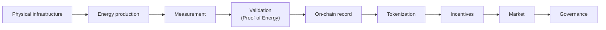
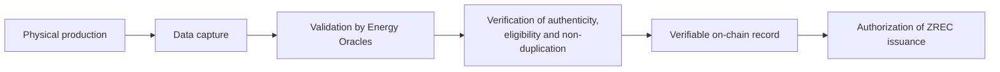
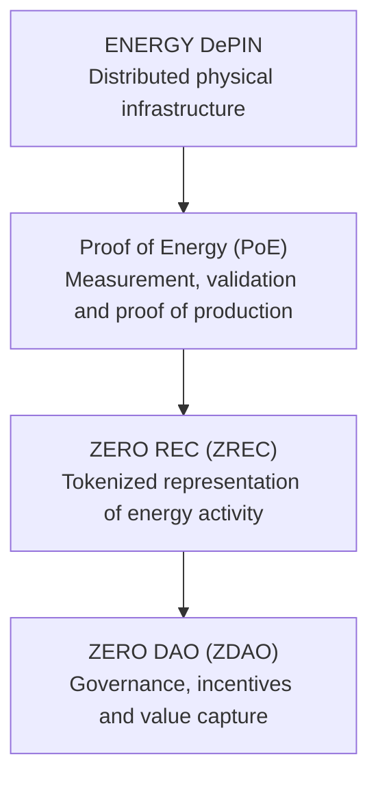
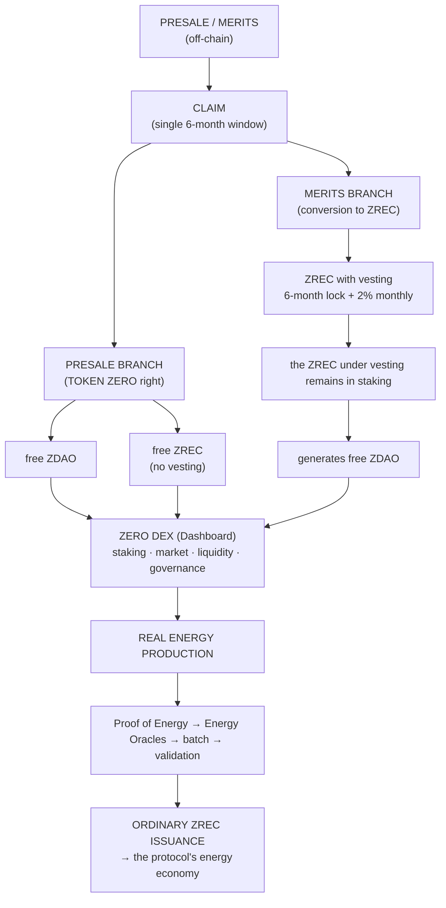

# 1. GENERAL ARCHITECTURE

## 1.1 What ZERO Energy is

ZERO Energy is a **decentralized physical infrastructure network (DePIN) applied to the energy sector**, deployed on the Base network.

The protocol connects real renewable generation installations with a verifiable digital economy. The value chain is:

DePIN is neither an add-on component nor a commercial label: it is the architectural framework within which everything else operates. Where more precise, ZERO Energy may be described as an **energy DePIN**.

## 1.2 Proof of Energy (PoE)

**Proof of Energy is the verification model through which physical energy production becomes a verifiable on-chain activity.** It is the layer that connects the physical infrastructure with the protocol's digital economy.

> **Mandatory delimitation.** Proof of Energy **is not a blockchain consensus mechanism**. Base maintains its own consensus and its own security. PoE operates in the protocol's energy validation layer and enables on-chain actions; it neither replaces nor modifies the network's consensus. This distinction must be maintained throughout all of the protocol's technical communication.

## 1.3 The two assets

| | | |
| --- | --- | --- |
| | **ZERO DAO (ZDAO)** | **ZERO REC (ZREC)** |
| Function | Governance and incentives | Energy and utility asset |
| Supply | Absolute maximum of 1,000,000,000 | No predefined maximum |
| Decimals | 8 | 3 |
| Origin | Presale (TOKEN ZERO), Merits, Staking, Strategic Issuances | Presale (TOKEN ZERO), Merits and certified production |
| In staking | Received as a reward | The asset that is deposited |

**Structural principle.** ZDAO maintains a strict issuance limit; ZREC expands as certified energy production grows. This separation allows the energy infrastructure to grow without compromising the scarcity of the governance asset. It is the economic foundation of the protocol and must not be altered.

## 1.4 Protocol layers

| | | |
| --- | --- | --- |
| **Layer** | **Component** | **Section** |
| Physical | Installations, meters, inverters | 4 |
| Validation | Energy Oracles, Proof of Energy | 4 |
| Assets | ZDAO and ZREC | 2 and 3 |
| Onboarding | Presale, TGE and Claim | 5 |
| Incentives | Official Staking System | 6 |
| Interface | ZERO DEX (Dashboard) | 7 |
| Governance | DAO, Committee, decentralization milestones | 8 |

## 1.5 Complete operating cycle

Each element of this cycle is developed only once in the document, in its corresponding section.
