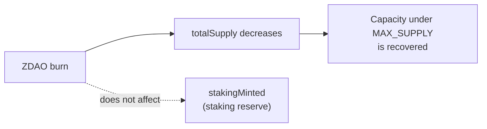
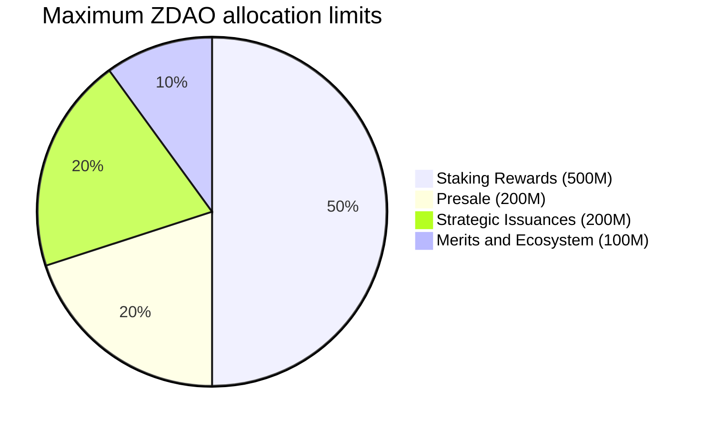
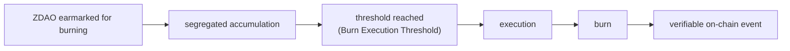

# 2. ZERO DAO (ZDAO)

ERC-20 governance and incentive token of the protocol, deployed on Base. **8 decimals**: the minimum unit is 0.00000001 ZDAO, the granularity required for the proportional calculation of rewards, fees and distributions.

## 2.1 Supply magnitudes

The document distinguishes the following magnitudes, which must not be confused:

| | |
| --- | --- |
| **Magnitude** | **Definition** |
| `MAX_SUPPLY` | 1,000,000,000 ZDAO. Absolute ceiling; it lives in the ZDAO ERC-20 token. It can never be exceeded |
| `totalSupply` | ZDAO in existence at this moment (minted minus burned). It is the token's standard circulating metric |
| Circulating supply | Equal to `totalSupply`: ZDAO has no locked positions |
| Minting capacity | `MAX_SUPPLY − totalSupply`, calculated in the ERC-20 itself. **It is recovered when ZDAO are burned** |
| `stakingMinted` | Total ZDAO minted by the staking contract. **It only grows: burning does not reduce it**. It lives in the staking contract, capped at 500M (Section 6.3) |
| Off-chain allocations | Minting rights registered in the Presale (denominated **TOKEN ZERO**) and in Merits, not yet minted |
| Burned ZDAO | Permanently destroyed; they reduce `totalSupply` |

**Invariants:**

- **ERC-20 token:** `totalSupply ≤ MAX_SUPPLY`, checked on every mint.
- **Staking contract:** `stakingMinted ≤ 500,000,000`, checked on every reward mint.

> **Separation of responsibilities.** `MAX_SUPPLY` lives in the ERC-20 token and bounds the global supply; `stakingMinted` lives in the staking contract and bounds only the issuance of rewards. ZDAO **has no locked positions**: staking rewards are free and immediately transferable (Section 6.5), and the Merits lock applies to the deposited ZREC principal, never to ZDAO.

ZDAO is **mintable and burnable** according to the standard ERC-20 mintable/burnable capability: any holder may burn their own ZDAO, and burning reduces `totalSupply`, which returns minting capacity under `MAX_SUPPLY`. The staking reserve (500M) and the decreasing issuance curve (Section 6.3) bound the issuance of rewards and are accounted for with `stakingMinted`, which burning does not roll back.

## 2.2 Burning returns minting capacity to the token, but not to the staking cap

Burned ZDAO are permanently destroyed and **reduce `totalSupply`**, thereby **returning minting capacity** under the ERC-20 `MAX_SUPPLY`.

```
Example:
MAX_SUPPLY ............... 1,000M
totalSupply .............. 600M
Burned ................... 100M
totalSupply (after) ...... 500M

Remaining minting capacity = 1,000M − 500M = 500M
(the 100M burned return as available capacity)
```

This is the standard ERC-20 mintable/burnable pattern: capacity is measured against the circulating `totalSupply`, so burning frees it.

**The staking cap is different.** `stakingMinted` is a monotonic counter of the staking contract (capped at 500M, Section 6.3). Burning ZDAO —including ZDAO that come from staking rewards— does **not** reduce `stakingMinted`, and therefore does **not** replenish the staking reserve or the decreasing curve. The staking contract can never mint more than 500M in total, however much is burned.



Consequences that must be respected throughout all protocol communication:

* A burn **may** be described as "returning minting capacity under `MAX_SUPPLY`", but never as "compensating the staking reserve".
* Any future policy on the ceilings requires express authorization by governance and cannot be presented as an automatic consequence of a burn.

## 2.3 Allocation limits

| | | | |
| --- | --- | --- | --- |
| **Program** | **Maximum limit** | **%** | **Nature** |
| Presale | up to 200,000,000 | 20% | Genesis allocation (Section 5) |
| Merits and Ecosystem | up to 100,000,000 | 10% | Single contributions bucket |
| Staking Rewards | up to 500,000,000 | 50% | Immutable reserve (Section 6) |
| Strategic Issuances | up to 200,000,000 | 20% | Requires express DAO approval |
| **Total** | **1,000,000,000** | **100%** | |



This table expresses **maximum limits**, not fixed amounts that will be minted. Actual issuance depends on actual activity:

* **Presale and Merits** depend on what is actually raised and claimed. The Presale is denominated in **TOKEN ZERO** —an off-chain minting right— which is resolved at the Claim, at the participant's choice, into ZDAO or ZREC (Section 5.4); Merits allocations are converted directly into ZREC (Section 5.5). The ZDAO corresponding to a ZREC choice are never minted.
* **Staking Rewards** are backed by an **immutable reserve of 500,000,000 ZDAO**: only the staking contract can mint against it, and only when a reward has been legitimately accrued. The reserve is a ceiling, not an obligation (Section 6.3).
* **Strategic Issuances** are a ceiling that requires express DAO approval.

The 500,000,000 staking reserve is an **invariant**: it cannot be allocated to treasury, team, liquidity, Merits, campaigns, strategic issuances or any purpose other than the Official Staking System. ZDAO not needed for rewards are not minted.

**The staking cap is cumulative.** The staking contract keeps `stakingMinted`, a monotonic counter that never decreases through burning. Although burning ZDAO returns general capacity under `MAX_SUPPLY` (Section 2.2), it does **not** replenish the staking reserve: the staking contract can never mint more than 500M over its entire lifetime.

**Merits and Ecosystem is a single bucket** (abbreviated "Merits" throughout the document). It comprises the founding team, contributors, ambassadors and user onboarding campaigns. **There are no separate quotas by category.**

**Strategic Issuances.** Intended destinations, of an **indicative and non-binding** nature: market liquidity (150,000,000) and contingencies (50,000,000). Any issuance against this program requires a proposal approved by the DAO and the timelock of Section 8. There is no automatic minting mechanism against this line item.

## 2.4 Fungibility

All issued ZDAO are fully fungible. The origin of their issuance alters neither the nature of the asset nor the rights it confers.

A technical consequence follows from this, which the protocol respects in its design: **an ERC-20 cannot distinguish the provenance of the tokens that make up a balance.** That is why no protocol rule depends on the origin of a specific ZDAO. The Presale choice between ZDAO and ZREC (Section 5.4), which does depend on the allocation, is resolved outside the token.

## 2.5 Functions

**Governance.** ZDAO confers voting rights over the configurable economic parameters, community proposals, the composition of the Protocol Committee, Strategic Issuances, the destination of the DAO Treasury's resources and protocol upgrades.

A precise distinction must be drawn: holders **decide by vote** the destination of the DAO Treasury. They hold no right to payment from it and do not participate in its distribution.

**Incentive.** ZDAO is the asset with which the protocol rewards participation in staking. Only those who have deposited ZREC receive these rewards. ZDAO does not represent energy production.

**Relationship with protocol activity.** ZERO DEX fees are distributed among the DAO Treasury, liquidity providers, the burn mechanism and infrastructure maintenance, according to the percentages in Section 7.

## 2.6 Burn mechanism

ZDAO contractually earmarked for burning **accumulate in a segregated and auditable manner** until a minimum execution threshold is reached.



**Initial Burn Execution Threshold: 10,000 ZDAO.** It is a parameter configurable by governance, not an economic constant.

The mechanism avoids hundreds of low-value burns, reduces operating cost and maintains on-chain traceability. Neither the DAO nor the Committee intervenes at the moment of execution: **the burn is triggered automatically by the fee-consolidation routine (a keeper or any user's transaction) when the segregated accumulation reaches the threshold**, and it emits a verifiable on-chain event. The segregated accumulation is held in a dedicated contract balance, separate from the circulating supply, until its execution.

In accordance with Section 2.2, ZDAO burned by this mechanism **reduce `totalSupply` and return minting capacity under `MAX_SUPPLY`**, but do **not** replenish the staking reserve (`stakingMinted` does not change).
