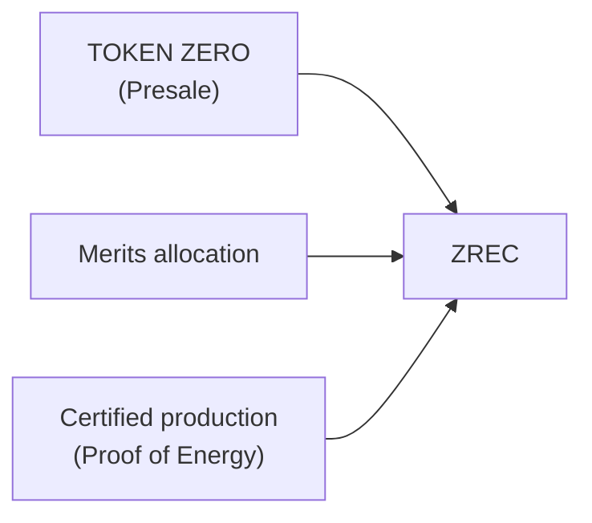
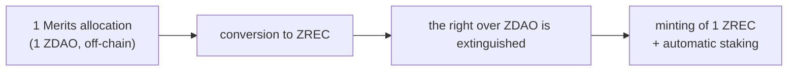
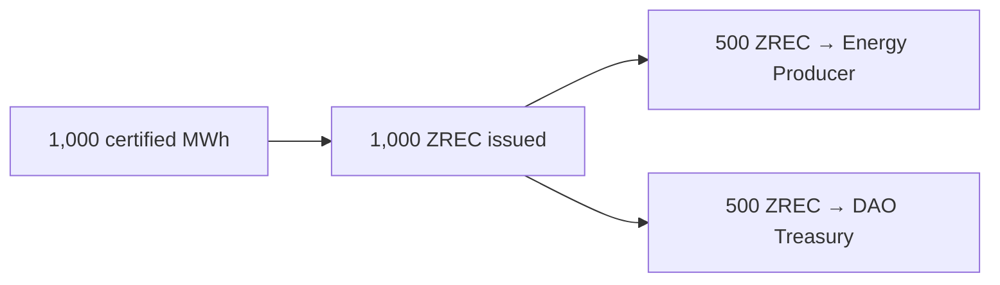
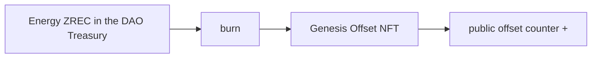

# 3. ZERO REC (ZREC)

Energy asset of the protocol and the **only asset that can be deposited in the Official Staking System**. ERC-20 token on Base.

## 3.1 Standard and decimals

```
1 ZREC     = 1 MWh = 1,000 kWh
0.1 ZREC   = 100 kWh
0.01 ZREC  = 10 kWh
0.001 ZREC = 1 kWh   ← minimum representable unit
```

**3 decimals.** The correspondence with the energy unit is deliberate: the minimum unit of the token is exactly 1 kWh, which makes it possible to represent everything from residential microgeneration to industrial parks.

The difference in precision with ZDAO (8 decimals) is intentional and EVM-compatible. Contracts must normalize both scales with safe integer arithmetic and explicit rounding rules, above all in the calculation of staking rewards, where ZREC is deposited and ZDAO is issued.

ZREC **has no maximum supply**. It grows as new energy production is certified.

## 3.2 Fungibility: a single token

ZREC is **a single fungible asset**. There are no distinct tokens for Presale ZREC, Merits ZREC, energy-production ZREC or ZREC acquired on the market.

Differences in behavior apply **to the position or the contract where the asset is deposited, never to the token**. A ZREC released from a Merits position is exactly the same asset as any other free ZREC.

Provenance may be kept as historical traceability information, but it does not affect fungibility.

This principle allows the Merits lock to exist without fragmenting the asset or market liquidity.

## 3.3 Three origins

| | | | |
| --- | --- | --- | --- |
| **Origin** | **When** | **How** | **Energy backing** |
| Presale ZREC | TGE + Claim window (6 months) | TOKEN ZERO minting right resolved into ZREC (Section 5.4) | No |
| Merits ZREC | TGE + Claim window (6 months) | Merits allocation resolved into ZREC (Section 5.5) | No |
| Energy ZREC | Permanent, after the window | Production certified through PoE | Yes |



### A. Presale ZREC

It is resolved **during the Claim**, in accordance with Section 5.4. A **TOKEN ZERO** minting right resolved into ZREC produces **free ZREC**: no lock and no mandatory stay in staking.

### B. Merits ZREC

It allows the energy economy and staking to start before sufficient certified production exists. It is resolved **during the Claim**, in accordance with Section 5.5.

**There is no mint-and-burn operation.** When a Merits allocation is converted into ZREC, the corresponding ZDAO **are never minted on-chain**. The correct formulation is:

> The conversion to ZREC extinguishes the right over the corresponding amount of ZDAO and enables the equivalent minting of ZREC, which is automatically deposited in staking with a special withdrawal schedule.



When the six-month window ends, this conversion path is **permanently and irreversibly disabled**.

### C. Energy ZREC

The only ordinary source of issuance after the Genesis window. It cumulatively requires real production, validation by the Energy Oracles and finalization of the batch in accordance with Section 4.

Distribution of each issuance:



The 50/50 split is configurable by governance between 30% and 70% for the Energy Producer's share.

**No initial per-producer issuance limit is established.** Governance may introduce one in the future if the development of the protocol requires it.

## 3.4 Differentiated accounting

The protocol permanently and separately publishes:

* Presale ZREC issued.
* Merits ZREC issued.
* Energy ZREC issued.
* ZREC retired from circulation, by type.
* Percentage of the Genesis issuance offset (Section 3.6).

The separation is **exclusively for accounting purposes**: it affects the published aggregates, not the units or fungibility.

It is necessary because during the Genesis phase almost all ZREC in circulation will come from the Presale and from Merits and, therefore, **will not represent energy actually produced**. Publishing the aggregates separately makes it possible to know at all times what proportion of the energy asset is backed by real production.

## 3.5 Economic value

ZREC has no predetermined price or fixed parity with respect to ZDAO, any currency or any other asset. **The protocol does not establish, sustain or aspire to sustain any value for ZREC.** Its value is freely determined by the market.

## 3.6 Genesis Offset Program

It progressively and verifiably attests that the Genesis issuance has been matched by real renewable production.

When the DAO Treasury receives Energy ZREC, it may allocate them to the program:

1. It selects ZREC accounted as Energy ZREC.
2. It permanently retires them from circulation by burning.
3. It issues the corresponding **Genesis Offset NFT**.
4. It increments the public cumulative offset counter.



**Scope and limits.** The program **does not modify, replace or individually back** the Genesis ZREC issued. It confers no right of exchange, refund or claim over energy. Its function is **accounting and demonstrative**: to publicly attest that the protocol has generated, certified and retired an amount of real renewable energy equivalent to a fraction of its Genesis issuance.

**Single-use rule.** A certified MWh cannot be counted twice. The Genesis Offset NFT is issued in the name of the DAO Treasury, is marked with that purpose and **is not transferable, nor can it be used by a third party as an environmental offset certificate**.

## 3.7 Energy Certification NFT

The protocol's energy certificate. Each NFT represents certified renewable energy permanently retired from circulation, and includes: unique identifier, Energy Producer and source installation, date, certified amount, Oracle validation reference, verifiable hash and **purpose** (third-party offset or Genesis Offset).

The purpose field determines the regime: Genesis Offset certificates are governed by Section 3.6 and are not transferable. The **Genesis Offset NFT** is, therefore, an instance of the Energy Certification NFT with `purpose = Genesis Offset`, not a distinct type of NFT.

> **Delimitation.** ZREC certifies **renewable generation verified by the protocol**. The NFT certifies the **retirement** within the protocol. Neither of them automatically equates to an official Guarantee of Origin, an I-REC or any other regulated certificate, unless the corresponding integration and accreditation exist. This distinction must be maintained throughout all communication.
