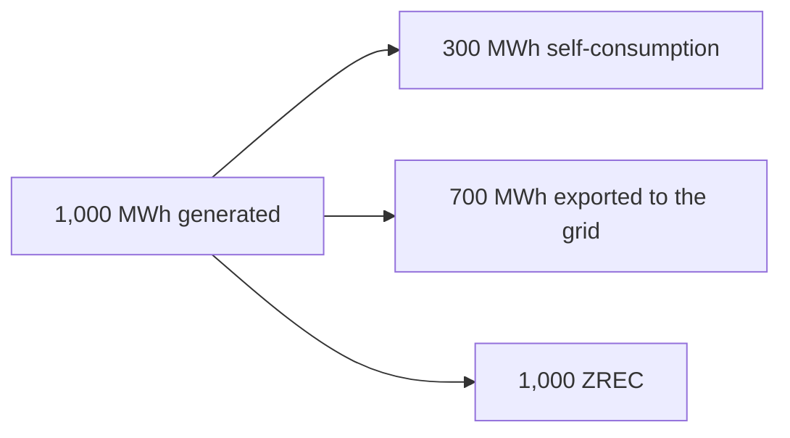
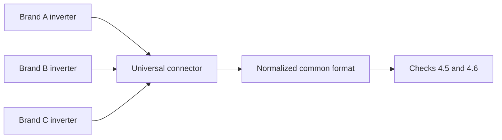
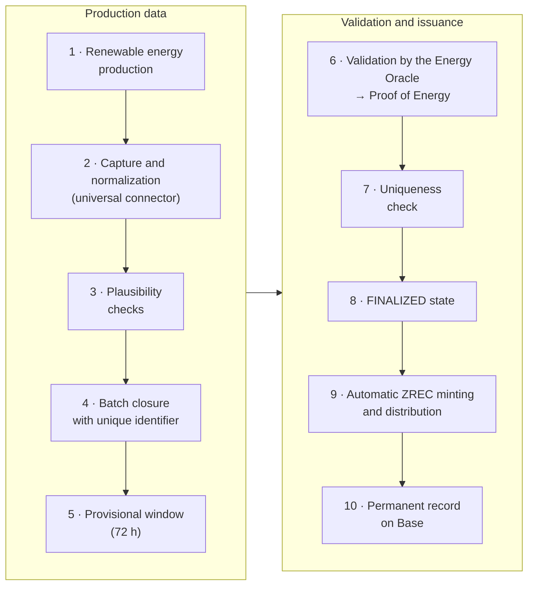

# 4. PROOF OF ENERGY AND ENERGY ORACLES

This section develops the layer that turns physical production into authorized ZREC issuance: what is certified, how the data is obtained, how it is validated and how it is grouped for on-chain registration.

## 4.1 What the protocol certifies

**ZERO Energy rewards all renewable energy actually generated and validated, regardless of its subsequent destination** —self-consumption, storage or export to the grid— and of whether or not that production is certified in other systems.

A producer who generates 1,000 MWh of renewable energy, self-consumes 300 and exports 700 to the grid has produced 1,000 MWh of renewable energy. If the protocol correctly verifies those 1,000 MWh at the point of generation, they are potentially 1,000 ZREC.

In its initial phase, the protocol operates as a **self-sustaining, pilot-stage ecosystem**: through Proof of Energy, it rewards with ZREC the production information transmitted by producers, without discriminating by how they use that energy or whether they certify it elsewhere. Its objective is to demonstrate in practice that the protocol can solve the traceability problems of renewable energy. Interoperability with other certification systems will be addressed in the advanced phases of decentralization (Section 8.6).

A rule that excluded energy exported to the grid would be technically incorrect —the protocol measures generation, not consumption— and would penalize precisely the professional producers, whose main activity is injecting energy into the grid.

## 4.2 Objectives of the validation layer

* Verify real renewable production and guarantee the authenticity of the data.
* Prevent fraud, manipulation and unauthorized issuance.
* **Avoid double issuance**: each unit of energy is associated with a single ZREC issuance and, upon retirement, with a single certificate for a single purpose.
* Maintain an auditable record of all validations.

The non-duplication principle is cross-cutting and binds the rest of the document.

## 4.3 Oracle model and progressive decentralization

**Initial model.** During the initial phase, energy validation is carried out by an **oracle operated by ZERO Energy itself and authorized by it**.

> The document **does not present the initial infrastructure as a decentralized oracle network**, because technically it is not one yet. Opening up to independent validators is a verifiable milestone of Section 8, not a statement of intent.

**Evolution.** The architecture is prepared to progressively admit multiple independent sources: smart meters, manufacturer APIs, inverters, SCADA, IoT systems, monitoring platforms, certifiers, external validators and grid operators.

It is not mandatory for all installations to have the same number or the same type of sources. The architecture allows **trust rules adapted to each installation typology**: a home with self-consumption and a photovoltaic park do not need the same level of redundancy.

**Requirements for external validators.** Their incorporation will follow security and maturity criteria: independence from the validated producer, technical capability, verifiable identity where necessary, availability, integrity and traceability of the data, cryptographic security, operational track record, absence of conflicts of interest and audited integration. The specific requirements that an external validator must meet are approved by the DAO by vote, with the timelock of Section 8.3.

> **The incorporation of a third party does not by itself constitute sufficient decentralization.** The goal is to evolve toward truly independent validation sources that operate reliably in production for a sufficient period.

**Uniqueness registry.** The system maintains a registry of batch identifiers already processed. Any request that references an already registered identifier is automatically rejected, regardless of the oracle that submits it.

**Delimitation between source and oracle.** The source obtains and normalizes the data; the oracle verifies and signs it. A component that only reads data does not thereby acquire oracle status, however technically sophisticated it may be.

## 4.4 Data acquisition

**Universal connector.** The protocol integrates a connector capable of obtaining production data from installations of different manufacturers **without requiring additional hardware at the point of generation**: the holder selects the manufacturer of their inverter, authorizes access to their production data and the connector normalizes it to a common format.

This model substantially lowers the entry barrier for residential microgeneration, the most numerous segment of the distributed infrastructure.

> **Shift in the trust model.** Not having a device at the measurement point does not reduce the risk: it shifts it from tampering with the meter toward the veracity of the declared installation and control of the manufacturer's account. That is why verification cannot rest on the data received and relies on the checks in 4.5 and 4.6.

## 4.5 Installation registration and verification

Before the first issuance, each installation is registered with: unique identifier, holder, location, **nominal power**, inverter manufacturer and model, and commissioning date.

**Nominal power is not accepted on the producer's declaration.** It is verified through three combined checks:

| | | |
| --- | --- | --- |
| | **Check** | **Content** |
| A | Documentation | Technical datasheet, certificate or equivalent information on the installation |
| B | Identification | Verifiable link between the physical installation, the holder, the meter, the inverter and the monitoring system |
| C | Empirical validation | Comparison of recorded production against the nominal capacity and the physical characteristics |

Empirical validation turns nominal power into a **physical coherence barrier**: an installation registered at 10 kWp that systematically declares 500 kW describes a physical impossibility, and the system can generate alerts, review, provisional suspension or a request for additional information.

Plausibility checks applicable to any production data:

* Coherence with the registered nominal power.
* Coherence with the irradiance corresponding to the location and date.
* Coherence with the weather conditions of the period.
* Coherence with the installation's own history, taking seasonality into account.
* Coherence with comparable installations in the same area and period.

These checks are **deterministic and reproducible** by any verifier that has the same input data.

> **Deliberate limitation.** When anomaly detection incorporates machine learning models, their function is limited to **prioritizing cases for review**, with no capacity to authorize an issuance on their own. The authorization of a mint must be justifiable through verifiable rules: no component whose criterion is not reproducible can serve as the basis for an issuance.

## 4.6 Energy batches

Production does not generate an on-chain transaction for each reading. Readings are aggregated into batches.

**Batch closure.** Initial configuration: **every 24 hours or upon reaching 1 MWh accumulated**, according to the configuration applicable to the installation and whichever occurs first. This hybrid criterion allows a solar home and a photovoltaic park to be managed with the same architecture. Parameter modifiable by governance.

**Batch identifier.** Each batch receives a unique identifier that **is the identifier in the uniqueness registry of Section 4.3**. A batch already processed cannot be processed again, however many times it is attempted. The system's idempotency derives from this: if a settlement fails and is retried, the registry prevents double minting.

**Provisional status: 72 hours.** Once the batch is closed, a window opens during which data reconciliation, anomaly detection, cross-checking of sources, additional validations and technically justified corrections may be carried out.

Upon reaching the **FINALIZED** state, the associated production is unequivocally identified as processed and cannot be reused in a second issuance. Minting is irreversible: the provisional window is the only mechanism that allows corrections to be incorporated. Governance may reduce its duration for high-trust producers or oracles.

**Precision and residues.** The conversion of accumulated energy into ZREC is performed with 3 decimals (minimum 1 kWh). **The non-representable fraction is carried over to the next batch**; under no circumstances is it discarded or rounded up. With a large number of low-power installations, systematic rounding in either direction produces a material accumulated deviation between certified energy and issued ZREC.

## 4.7 Complete validation flow

