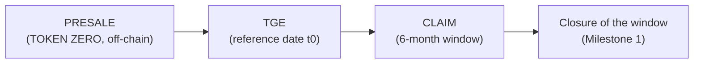
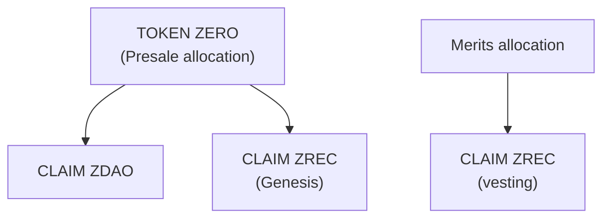
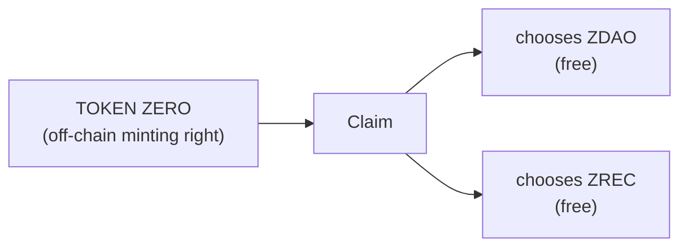
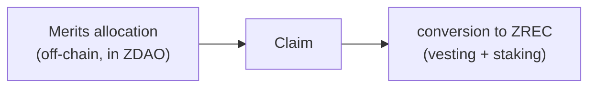
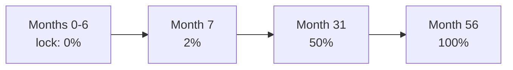
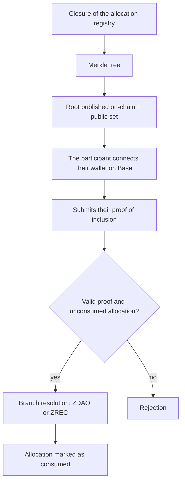

# 5. GENESIS PHASE: PRESALE, TGE AND CLAIM



## 5.1 Presale: TOKEN ZERO

Initial funding mechanism. Allocations are recorded **off-chain** under the Presale denomination **TOKEN ZERO**.

**A TOKEN ZERO is a future minting right**, not a minted token. What the participant acquires during the Presale is the right to mint, at the Claim, one ZDAO or one ZREC. Minting occurs solely through the Official Claim System after launch, which is where the right is resolved into ZDAO or ZREC. Separating funding from effective issuance enables a verifiable distribution without pre-minting.

**Maximum allocation: 200,000,000 TOKEN ZERO** (equivalent to 20% of `MAX_SUPPLY`). The percentages of each tranche are calculated **over those 200,000,000**, not over the global `MAX_SUPPLY`.

| | | | | | |
| --- | --- | --- | --- | --- | --- |
| **Tranche** | **% of the Presale** | **TOKEN ZERO** | **Price** | **Minimum investment** | **Amount raised** |
| 1 | 0% – 5% | 10,000,000 | 0.10 USDC | 1,000 USDC | 1,000,000 |
| 2 | 5% – 15% | 20,000,000 | 0.25 USDC | 500 USDC | 5,000,000 |
| 3 | 15% – 40% | 50,000,000 | 0.50 USDC | 250 USDC | 25,000,000 |
| 4 | 40% – 70% | 60,000,000 | 0.65 USDC | 100 USDC | 39,000,000 |
| 5 | 70% – 100% | 60,000,000 | 0.75 USDC | 10 USDC | 45,000,000 |
| **Total** | | **200,000,000** | **0.575 on average** | | **115,000,000** |

The **Amount raised** column and the **average price of 0.575** are **theoretical maximums**: they assume full subscription of the five tranches. Since each tranche remains available until its units are exhausted, the actual amount raised may be lower.

**The tranches operate in parallel.** Each tranche has an independent allocation and remains available until its units are exhausted or until another closing condition established by the protocol occurs. **It is not necessary to exhaust one tranche to enable the next.** The minimum investment is the access criterion for each tranche.

**Unallocated supply.** Presale TOKEN ZERO that are not allocated are not minted and do not automatically pass to any other program.

The resources obtained are allocated to the development of the blockchain and energy infrastructure, the implementation and audit of the contracts, the onboarding of producers, the development of ZERO DEX and the growth of the ecosystem.

## 5.2 Token Generation Event (TGE) and Claim window

**The TGE is the launch milestone that fixes the reference date and opens the Claim window.** It does not mint or distribute assets by itself: minting occurs only when a participant claims their allocation.

* The TGE fixes the reference date (`t0`) from which the Claim window and the Merits schedules are calculated.
* The Claim window lasts **six (6) months** from the TGE.
* Presale participants exercise their **TOKEN ZERO** minting right by choosing, at the Claim, between ZDAO and ZREC (both without vesting).
* Merits participants convert their allocations into ZREC with a vesting schedule (Section 5.5).
* The staking positions corresponding to Merits ZREC are created automatically.

When the window closes, the possibility of claiming a Genesis allocation also closes. **Allocations not claimed within the window lose the minting right**: those tokens are never minted.

## 5.3 Claim options

Each Genesis allocation admits, at the moment of the Claim, a single, one-time choice that definitively consumes the allocation. Only Presale allocations (TOKEN ZERO) involve a choice; Merits allocations are resolved directly into ZREC (Section 5.5).



Once an option is executed, the allocation is definitively consumed. Consequently:

* A second Claim cannot be made on the same allocation.
* It cannot be duplicated using different wallets.
* It cannot be exercised with tokens acquired on secondary markets.

Since ZDAO and ZREC are ordinary fungible tokens (Sections 2.4 and 3.2), an ERC-20 cannot distinguish the provenance of the tokens in a balance. That is why the choice is resolved in the off-chain allocation registry during the Claim, never in the token. This eliminates by design the vector *wallet A claims → transfers to wallet B → wallet B tries to claim again*: the operation is impossible because the allocation was consumed in the initial Claim.

## 5.4 Presale branch: ZDAO or ZREC

A **TOKEN ZERO** (the Presale minting right) is resolved, at the Claim, into **ZDAO or ZREC**, at the participant's choice. Both options are **free of vesting**: no lock and no mandatory stay in staking.



Ratio: **1 TOKEN ZERO = 1 ZDAO or 1 ZREC**. There is no burn: the ZDAO of a ZREC choice are never minted.

* **ZDAO**: minted on-chain, completely free, fungible and transferable, with no lock.
* **ZREC**: minted on-chain, completely free, with no vesting, no lock and no minimum stay in staking. The participant may hold it, transfer it, sell it, swap it, provide it as liquidity or voluntarily deposit it in staking under the general withdrawal rules.

This path gives Presale participants direct entry into the protocol's energy economy and into ZREC staking.

## 5.5 Merits branch: ZREC with vesting

Merits allocations are recorded off-chain, denominated in ZDAO. At the Claim, the participant **converts the allocation into ZREC** (there is no ZDAO option). The ZREC is minted and **automatically deposited in staking**, where it remains generating ZDAO under a special withdrawal schedule: the Merits **vesting**.



Ratio: **1 ZDAO allocated through Merits = 1 ZREC**. There is no burn: the ZDAO are never minted.

**Vesting is not a separate contract.** The time restrictions are applied **directly through the withdrawal rules of the position within the Official Staking System**. The correct formulation is **"Merits ZREC → staking with a special withdrawal schedule (vesting)"**.

The ZREC remain **in staking throughout the entire schedule** and generate ZDAO from day one. The ZDAO generated as rewards are **free and immediately transferable** (Section 6.5): the lock applies only to the deposited ZREC principal.

**Availability schedule (vesting)**

| | | |
| --- | --- | --- |
| **Phase** | **Duration** | **Availability** |
| Initial lock (cliff) | 6 months | 0% |
| Progressive release | 50 months | 2% monthly of the initial allocation |
| **Total** | **56 months** | **100%** |



During the first six months, no principal may be withdrawn, the deposited ZREC may not be sold or transferred, and no mechanism intended to circumvent the lock may be used. The position participates in staking from day one.

```
Example: initial allocation of 100,000 ZREC

Months 0-6 ..... 0 ZREC available
Month 7 ........ 2,000 ZREC available
Month 8 ........ 4,000 ZREC available
Month 31 ....... 50,000 ZREC available
Month 56 ....... 100,000 ZREC available
```

Each monthly tranche that reaches its date may be withdrawn. **Once withdrawn, the ZREC is completely free** and equivalent to any other. The restriction affects exclusively the part of the position that has not yet reached its availability.

## 5.6 Official Claim System

**Prior consolidation.** Before the Claim opens, the allocation registry is closed, a Merkle tree is generated with all allocations and their conditions, its root is published on-chain and the complete set is published for independent verification. From that moment, the set is immutable and any participant can verify their allocation without depending on the protocol.

**Execution.** The participant connects a Base-compatible wallet, obtains their proof of inclusion and submits it to the contract, which verifies the proof against the published root, checks that the allocation has not been consumed, resolves the corresponding branch and marks the allocation as permanently consumed.



This model is preferable to an authorization issued by a server: the published root fixes the set of allocations immutably and auditably **before a single asset is minted**, and no external infrastructure retains the capacity to authorize minting. Any modification of the root requires DAO approval and the timelock of Section 8.
