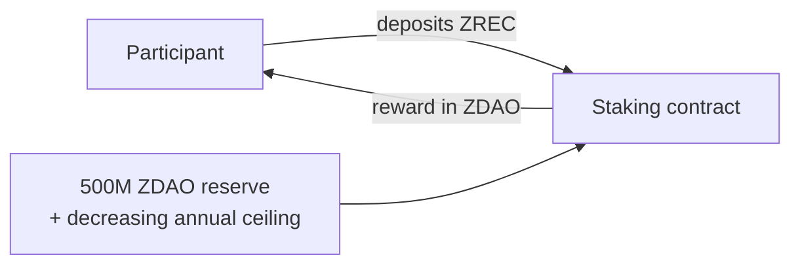
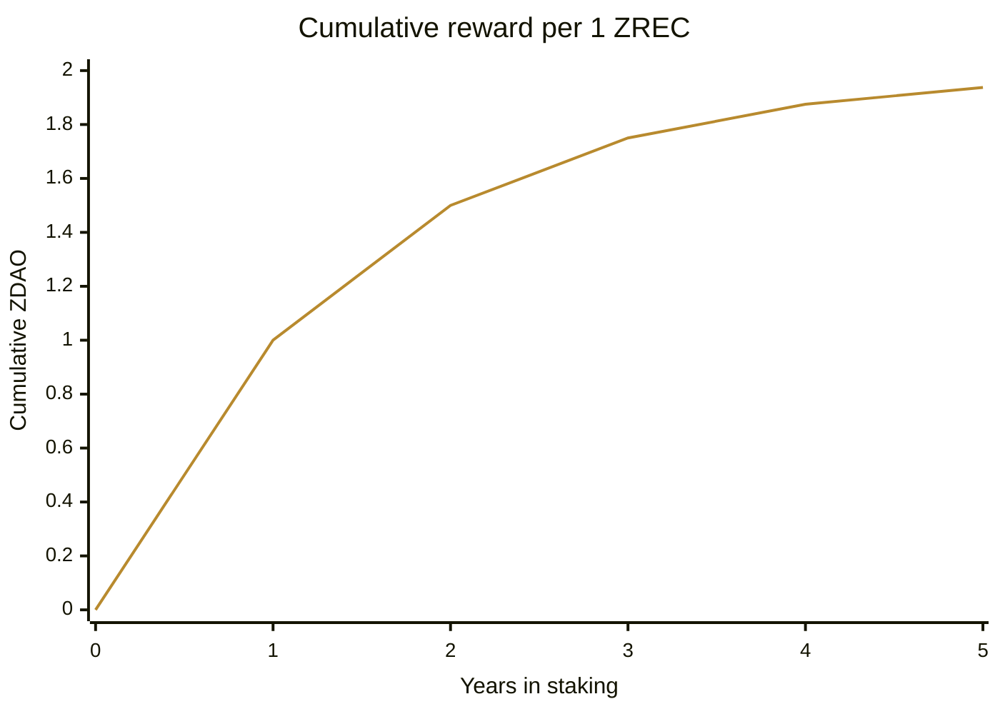
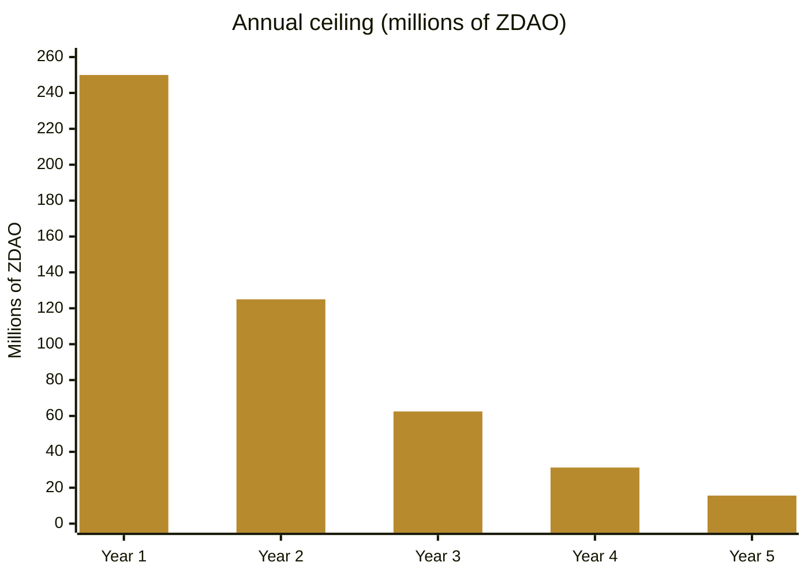
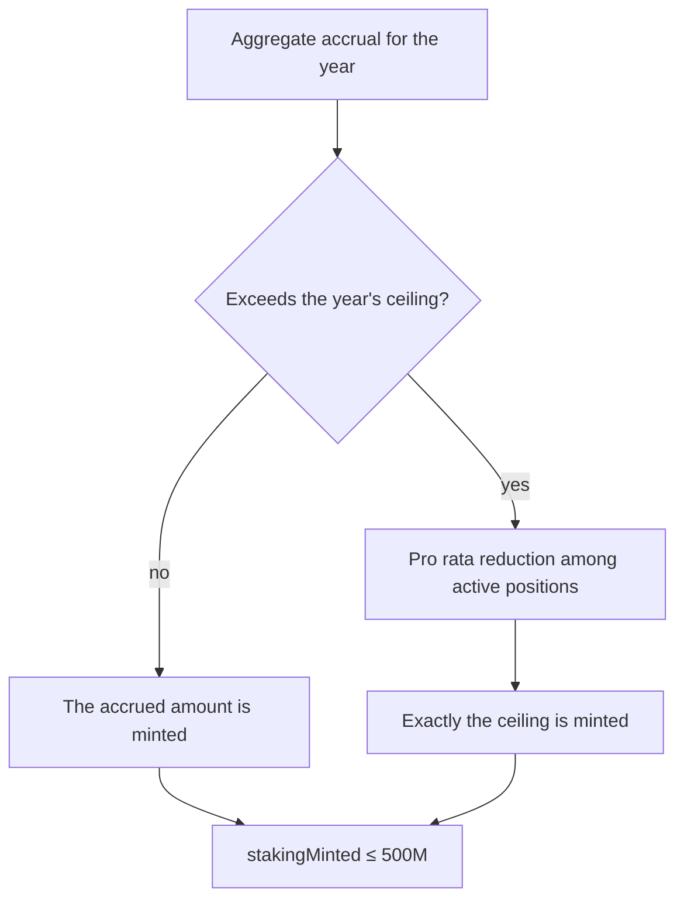
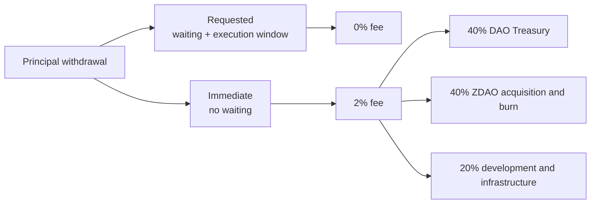

# 6. OFFICIAL STAKING SYSTEM

**ZREC** is deposited and **ZDAO** is received. It is the only mechanism through which the 500,000,000 ZDAO of the rewards reserve can be minted, within the limit of the decreasing curve (Section 6.3).

## 6.1 Technical basis

The Official Staking System is a **proprietary development of ZERO Energy, with its own rules**: a decreasing rewards model in which the annual rate is 100% in the first year and halves each year, with an issuance ceiling of 250,000,000 ZDAO in the first year that also halves each year.

The asset that is deposited (ZREC) and the one received as a reward (ZDAO) are different, which requires explicitly defining the relationship between the two and the normalization between their decimal scales (3 in ZREC, 8 in ZDAO).

## 6.2 Rewards model

The system **does not admit any interpretation as a guaranteed fixed return**. The reward accrues **linearly over time**, with an annual rate that **halves each year**: a position held for a full year accrues **100% of its principal**; a second full year, **50%** of the principal; a third, **25%**; and so on. The reward is expressed in **ZDAO per deposited ZREC**.

### Time component (position age)

The reward accrues **linearly** within each year of staking. The annual reward rate, according to the year of staking, is:

$$ r_{n} = \frac{100\,\%}{2^{\,n-1}} $$

| | |
| --- | --- |
| **Staking year** | **Annual rate** |
| Year 1 | 100% |
| Year 2 | 50% |
| Year 3 | 25% |
| Year 4 | 12.5% |
| Subsequent | halves each year |

A position accrues the rate of its current year **in proportion to the time actually deposited within that year**. The rate is flat within each year: there is no preferential weighting of early or late holding periods.

### Accrual

The total reward is the sum, for each year of staking, of that year's rate applied to the time deposited in that year:

$$ reward = amount \cdot \sum_{n \ge 1} r_{n} \cdot \frac{\;t_{n}\;}{Y} $$

where $Y = 365$ days and $t_{n}$ is the portion of year $n$ during which the position was deposited (in days, with a maximum of $Y$). Specifically:

- $T = 0$ → $reward = 0$.
- $T = 365$ days → $reward = amount$ (**100% of the principal**).
- $T = 2$ years → $reward = 1.5 \cdot amount$ (**150%**, i.e., 100% + 50%).
- $T = 3$ years → $reward = 1.75 \cdot amount$ (**175%**).
- A half-year position → $reward = 0.5 \cdot amount$ (**50%**).

Accrual is therefore **piecewise linear**: a flat annual rate that halves at each year boundary.

Cumulative reward per 1 deposited ZREC, in ZDAO, before applying the ceilings of Section 6.3:

> **Why this form.** Linearity makes the reward transparent and predictable at any moment, with no normalization constants or slope parameters to adjust. The halving schedule (`100% → 50% → 25% …`) follows **the same pattern** as the annual issuance ceiling of Section 6.3, so that the reward rate and the issuance limits decrease together.

**No automatic compounding.** There is no separate growth factor or compound interest: linear accrual alone determines the entire reward.

**Only the ZDAO actually accrued are minted**, within the reserve and the annual ceilings of Section 6.3. ZDAO not needed for rewards are simply not minted.

> **Scope of the figures.** The rates in this section describe the contract's calculation in ZDAO per ZREC. They are neither a return in any currency nor a guarantee: the economic value of a reward depends on the price ratio between ZDAO and ZREC, which is set by the market, and on the ceilings of Section 6.3, which may reduce the accrual of all positions.

## 6.3 Issuance limits

Two limits operate cumulatively on the result of the formulas above, together with the `MAX_SUPPLY` ceiling.

**1. Absolute staking reserve — invariant.** 500,000,000 ZDAO. It cannot be allocated to treasury, team, liquidity, Merits, campaigns, strategic issuances or any purpose other than the Official Staking System. Only the staking contract can mint against it, and only when a reward has been legitimately accrued.

**2. Decreasing maximum curve.** Issuance ceiling per year, as an upper limit:

| | |
| --- | --- |
| **Year** | **Maximum issuance** |
| Year 1 | up to 250,000,000 ZDAO |
| Year 2 | up to 125,000,000 ZDAO |
| Year 3 | up to 62,500,000 ZDAO |
| Year 4 | up to 31,250,000 ZDAO |
| Subsequent | halves each year |

The first-year ceiling is 250,000,000 ZDAO and halves each subsequent year. These values are **maximum ceilings, not issuance obligations**: if the rewards accrued in a year fall below the available ceiling, the difference **is not minted automatically**. The document must not describe these amounts as figures that will necessarily enter circulation.

**Why the ceiling is necessary.** ZREC grows without limit as certified production increases. A percentage rate applied to a growing deposited base produces growing issuance; without a ceiling, the greater the protocol's energy success, the sooner the rewards reserve would be exhausted. The decreasing curve bounds that risk.

> **Mechanism.** The staking contract accounts for the ZDAO minted in each year against the curve. If the aggregate accrual of a year were to exceed that year's ceiling, the accrual is reduced pro rata among the active positions, so that the year's total never exceeds the ceiling. The unused portion of a year's ceiling does not carry over to the next.

Only the ZDAO actually accrued are minted (and within both ceilings). Issuance thus follows real usage —participation in staking and circulating supply—, bounded by the reserve, the decreasing curve and `MAX_SUPPLY`.

## 6.4 Position types

The system uses **individualized positions**, each with its own amount, entry date, age, accumulated rewards, type, status and withdrawal availability. Each contribution constitutes an independent position with its own age computation.

| | | |
| --- | --- | --- |
| | **Free staking** | **Merits staking** |
| Applicable to | Presale ZREC, Energy ZREC, market ZREC | ZREC from the Merits conversion |
| Entry | Voluntary | Automatic during the Claim |
| Lock | No | Initial 6 months |
| Availability | General withdrawal rules | 2% monthly for 50 months (vesting) |
| Rewards | General model | General model, identical |

**Both types use the same ZREC.** No distinct versions of the token are created to represent its provenance (Section 3.2). The difference lies **exclusively in the principal withdrawal rules**.

## 6.5 Rewards of Merits positions

Merits ZREC **generate rewards from the start of their position, including the six-month lock period**, under the same general economic model. There is no differentiated formula.

The ZDAO generated as rewards:

* come exclusively from the staking reserve, not from the Merits Program;
* **do not inherit the lock** of the ZREC that generated them;
* are free as soon as they are distributed.

## 6.6 Withdrawal

Two modalities for free positions and for the available portion of Merits positions:

| | | |
| --- | --- | --- |
| **Modality** | **Procedure** | **Fee** |
| Requested | Waiting period + execution window | 0% |
| Immediate | No waiting period | 2% of the principal withdrawn |

**Immediate withdrawal fee: 2% initially** on the principal withdrawn. This is the initial value, not a permanent value: the DAO may modify it by vote within the **range of 0.50% to 5.00%**.

**Initial fee split**, modifiable by governance within the limits of the protocol:

| | |
| --- | --- |
| **Destination** | **Initial** |
| DAO Treasury | 40% |
| ZDAO acquisition and burn | 40% |
| Development and infrastructure | 20% |
| Liquidity providers | 0% |

This fee is independent of the ZERO DEX fees and does not necessarily follow their split. The portion allocated to acquisition and burn is accumulated and executed according to the Burn Execution Threshold of Section 2.6.

**Merits positions.** Immediate withdrawal does not allow the lock to be circumvented: during the first six months, no principal may be withdrawn through either route. Thereafter, only the amount already available according to the progressive release of 2% monthly over 50 months may be withdrawn (Section 5.5).
