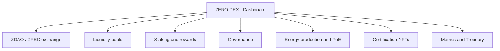
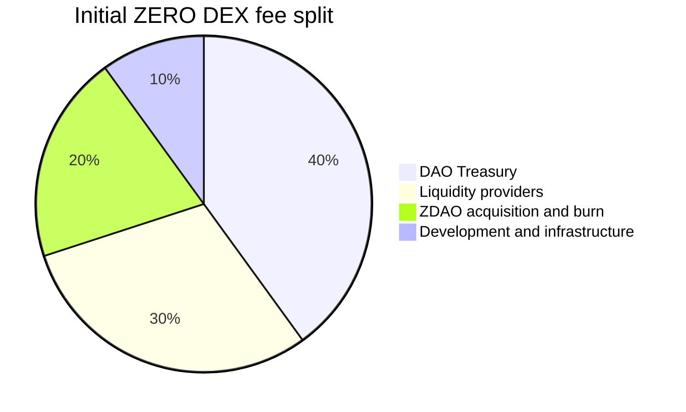

# 7. ZERO DEX

## 7.1 Nature

**ZERO DEX is the main Dashboard and the decentralized interface of the ecosystem**, not merely an exchange or a set of liquidity pools. It is the layer through which users interact with the protocol's on-chain infrastructure.

The following distinction must be made expressly:

```
ZERO DEX = Dashboard and interface of the ecosystem
Contracts, pools, routers, liquidity protocols = underlying technology layer
```

ZERO DEX may interact with proprietary, external or aggregated infrastructure.

## 7.2 Functionalities

They are integrated progressively: exchange of ZDAO, ZREC and compatible assets; access to liquidity pools; ZREC staking and position management; collection of rewards; interaction with governance; energy production and Proof of Energy information; visualization of ZREC and of Energy Certification NFTs; producer and installation information; protocol metrics and Treasury information; DeFi functionalities and future applications built on ZERO Energy.



**Restriction.** The market operates exclusively on a spot basis. No trading with leverage, margin or derivative instruments on the ecosystem's assets is offered. Incorporating any functionality of that nature requires an express DAO decision and a prior review of the architecture.

## 7.3 Fees

Operations generate a **fee on the traded volume**, which is collected in the input asset and consolidated periodically.

**Fee: 0.30% of volume (initial), configurable by governance in the range 0.05% – 1.00%** (Section 11.2).

The fee is distributed among the following destinations:

| | | |
| --- | --- | --- |
| **Destination** | **Initial** | **Configurable range** |
| DAO Treasury | 40% | 20% – 50% |
| Liquidity providers | 30% | 20% – 50% |
| ZDAO acquisition and burn | 20% | 0% – 30% |
| Development and infrastructure | 10% | 0% – 20% |



The sum must at all times equal 100%; the contract rejects any configuration that does not comply with this. The fraction allocated to burning is accumulated and executed according to the Burn Execution Threshold of Section 2.6.
