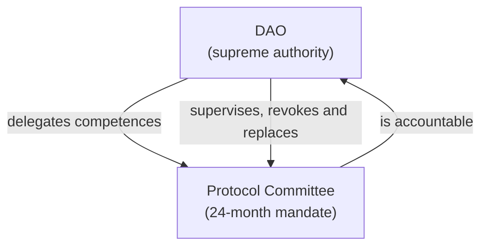
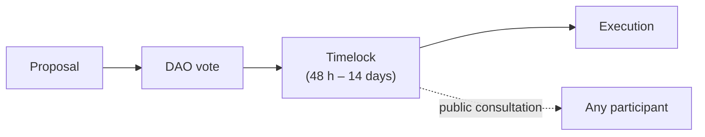

# 8. GOVERNANCE AND PROGRESSIVE DECENTRALIZATION

## 8.1 DAO and Protocol Committee

The **DAO is the supreme governance authority**. The **Protocol Committee** is an operational body with delegated competences, **not an authority above the DAO**.

**Initial mandate of the Committee: 24 months.** One year is insufficient to manage energy infrastructure; periods of four or five years concentrate too much power. Twenty-four months allow for both work and accountability.

The Committee is subject to renewal, early revocation through the governance mechanisms, replacement for justified cause, transparency obligations, accountability, limits on its competences and supervision by the DAO.

**The Committee cannot** mint tokens, modify parameters outside their range or dispose of the DAO Treasury without prior approval.

## 8.2 Administrative permissions

The protocol recognizes exclusively the following permissions. No other permission exists over the core contracts.

| | | | |
| --- | --- | --- | --- |
| **Permission** | **Holder** | **Scope** | **Lifecycle** |
| Reward minting | Staking contract | 500M reserve, bounded by the decreasing curve | Permanent |
| Minting via Claim | Claim contract | Allocations from the published root | Extinguished when the window closes |
| Genesis ZREC minting | Claim contract | Presale (TOKEN ZERO) and Merits allocations resolved into ZREC | Extinguished when the window closes |
| Energy ZREC minting | Energy Issuance contract | Finalized batches | Permanent |
| Oracle operation | ZERO Energy | Signing of validations | Opened to third parties (Milestone 3) |
| Strategic minting | Governance | Strategic Issuances | Subject to the supply invariant |
| Parameter configuration | Governance | Ranges of Section 11 | Permanent |
| Contract upgrades | Governance | Core contracts | Renounced (Milestone 5) |
| Emergency pause | Protocol Committee | Temporary suspension | Renounced (Milestone 5) |

**No minting permission rests with an address controlled by individuals.** Permissions are held by contracts, whose behavior is verifiable.

## 8.3 Timelock

Every execution arising from the governance contract is subject to a mandatory waiting period, during which the pending transaction can be publicly consulted.

| | |
| --- | --- |
| **Operation** | **Minimum period** |
| Parameters within range | 48 hours |
| DAO Treasury operations | 72 hours |
| Strategic Issuances | 7 days |
| Modification of the oracle set | 7 days |
| Upgrade of core contracts | 14 days |

Its purpose is to guarantee that no decision affecting the assets or the logic of the protocol can be executed without participants having time to learn of it and react.

## 8.4 Emergency pause

The Committee may temporarily suspend operations in the event of a security incident, with strict limits: **it does not allow minting, transferring or disposing of any asset**; maximum duration of 72 hours with automatic lifting; extension subject to DAO approval; public justification within 24 hours.

## 8.5 Contract upgrades

The core contracts are deployed with upgrade capability during the initial phases, in order to correct defects detected in audit or in production. Every upgrade requires DAO approval, a 14-day timelock, a prior audit and publication of the proposed code throughout the entire waiting period.

**No upgrade may modify an invariant of Section 11.** The invariants are implemented so that their verification does not depend on upgradable code. The upgrade capability is extinguished at Milestone 5.

## 8.6 Progressive decentralization by milestones

**Decentralization is not tied to calendar dates.** A protocol does not become decentralized because a date arrives. Each milestone is defined through **objective and verifiable conditions**, and some conditions must be met simultaneously, so that no one can artificially accelerate the process in order to gain power or unlock a capability.

Variables that may be considered jointly: number of independent producers, certified energy, diversity of data sources, number and distribution of validators, maturity of the Energy Oracles, TVL, maturity and audits of the contracts, activity and distribution of participation in governance, and operational security.

**The specific criteria for each milestone are approved by the DAO by vote**, with the timelock of Section 8.3, as the protocol evolves.

Each milestone entails an **irreversible renunciation** of a control capability: once executed, it cannot be reversed by any mechanism, including contract upgrades.

| | | |
| --- | --- | --- |
| **Milestone** | **Renunciation** | **Verification** |
| 1. Closure of the Genesis window | The Claim is disabled | The functions revert unconditionally |
| 2. Consolidation of issuance | ZDAO minting permissions are extinguished, except staking and strategic | Public list of authorized addresses |
| 3. Independence of validation | ZERO Energy ceases to control energy validation | Public list of oracles and their accredited independence |
| 4. Ecosystem maturity | Criteria defined by governance | Published metrics |
| 5. Immutability | Contract upgrades and the emergency pause are renounced | Administrative address with no capacity to act |
| 6. Full governance | The Committee loses all capacity for initiative | Proposals originate only from the governance contract |

> Until **Milestone 3** is executed, energy validation depends on infrastructure operated by ZERO Energy. The document states this expressly in Section 4.3 rather than presenting as decentralized a mechanism that is not yet so.

## 8.7 Publication of status

The protocol publishes, permanently and in a consultable manner: the milestone reached and the transaction of each renunciation executed; the list of addresses with an active minting permission; the pending transactions in the timelock; the composition of the Committee and of the oracle set, indicating their operator; `totalSupply`, the remaining issuance capacity and the status of the staking reserve (`stakingMinted`); the number of registered installations and the cumulative certified energy; and the percentage of the Genesis issuance offset.

> The degree of decentralization of a protocol is not declared: it is demonstrated by the list of capabilities that have been verifiably renounced.
