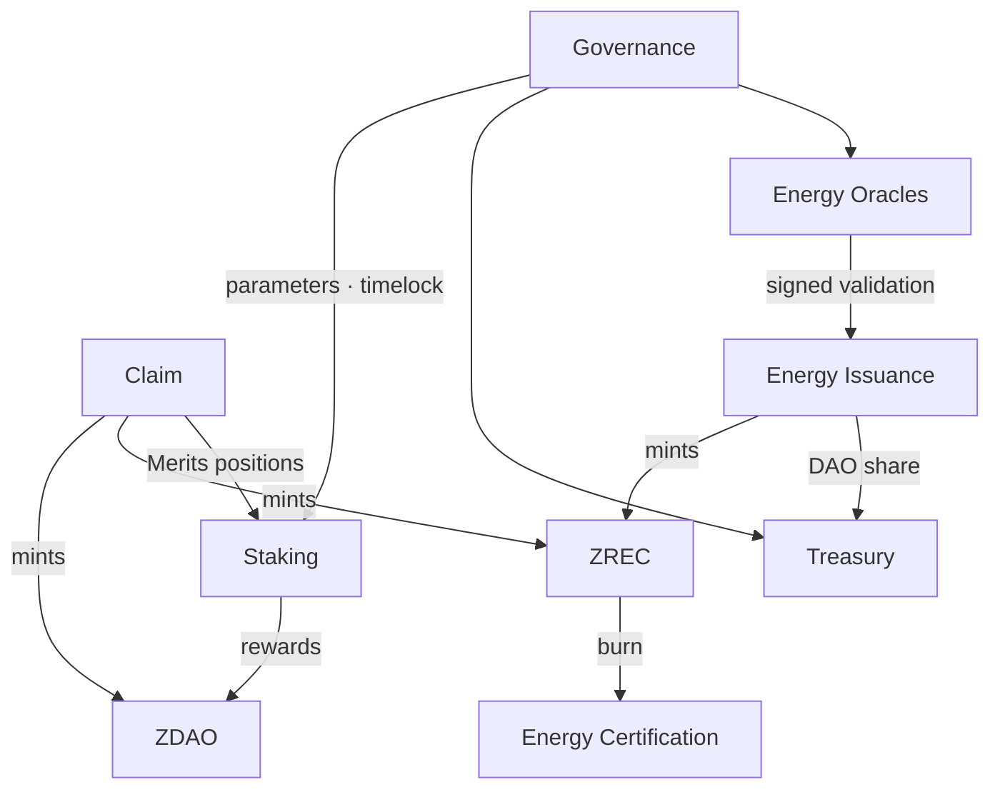

# 9. CONTRACT ARCHITECTURE

Modular infrastructure on Base, with decoupled responsibilities.

| | |
| --- | --- |
| **Contract** | **Main responsibilities** |
| ZERO DAO (ZDAO) | ERC-20, 8 decimals, mintable and burnable. `MAX_SUPPLY` enforced against `totalSupply`. Minting restricted to authorized addresses. Burning returns minting capacity |
| ZERO REC (ZREC) | ERC-20, 3 decimals, single fungible asset. Minting from the Claim (Presale and Merits) and from Energy Issuance. Differentiated Genesis / Energy accounting |
| Claim | Verification of Merkle proofs against the published root. Resolution of the TOKEN ZERO minting right (ZDAO/ZREC choice) with single consumption. Delivery of ZDAO (Presale) or minting of ZREC (Presale and Merits), with automatic staking for Merits positions |
| Energy Issuance | Verification of the oracle's validation. Uniqueness registry by batch identifier. Batch status and provisional window. Minting and distribution |
| Staking | Individualized positions. Reward model linear over time with a rate that halves each year (100% year 1, 50% year 2…). Withdrawal rules differentiated by position type. Cumulative `stakingMinted` counter capped at the 500M reserve and bounded by the decreasing curve |
| Energy Certification | Burning of ZREC allocated to offsetting. Issuance of the NFT with its purpose. Non-transferability of Genesis Offset certificates |
| Governance | Proposals and votes. Parameters within range. Appointment and revocation of the Committee. Execution subject to timelock |
| Treasury | Multisig custody. Receipt of the energy share of ZREC. Exclusive execution of approved operations |
| Energy Oracles | Registry of authorized oracles. Signed authorizations with timestamp and expiry. Auditable record of validations |

**Data acquisition layer.** Off-chain infrastructure (Section 4.4). It is not part of the set of contracts and **holds no permission whatsoever over them**. Its replacement or unavailability does not affect the integrity of assets already issued.

The architecture must allow new contracts, services and integrations to be incorporated without replacing the core contracts.
